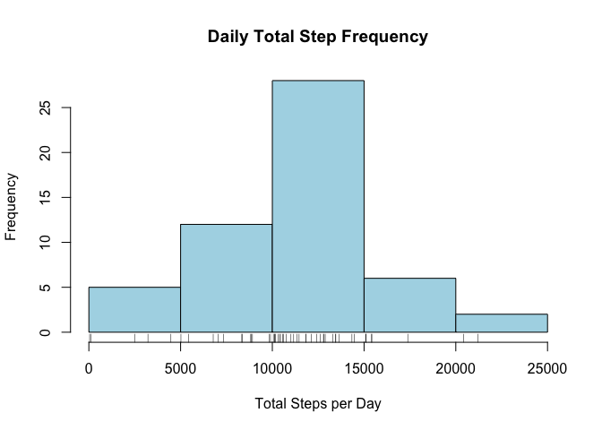
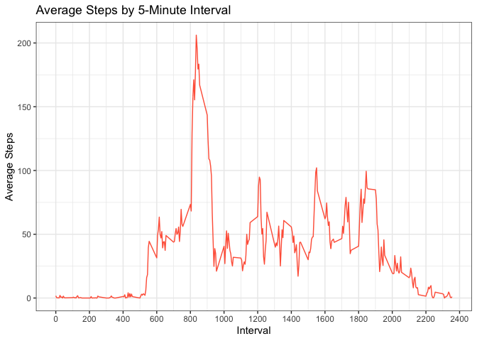
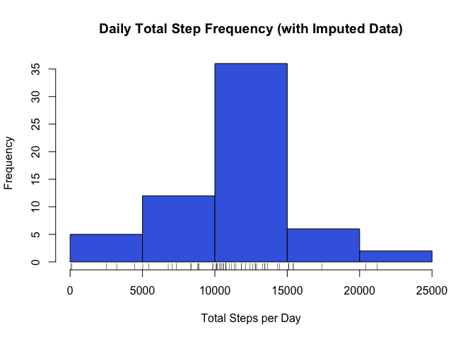
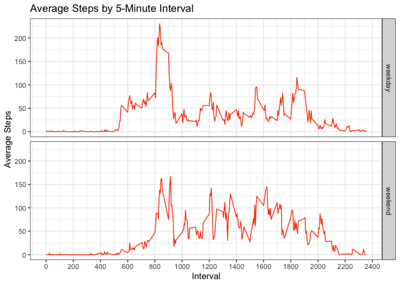

This is a markdown document with code and accompanying explanations to analyze data from a personal activity monitoring device. The device collected the number of steps taken by an anonymous individual at 5-minute intervals during the months of October and November, 2012.

## Loading and pre-processing the data

Load necessary libraries

```r
library(lubridate)
library(ggplot2)
library(dplyr)
```
Create main dataframe

```r
url<-"https://d396qusza40orc.cloudfront.net/repdata%2Fdata%2Factivity.zip"
download.file(url, destfile = paste0(getwd(),"/activity.zip"))
unzip("activity.zip")
activity<-read.csv("activity.csv", header=T, stringsAsFactors=F, na.strings = "NA")
```

Change class of the date column to "Date" with lubridate

```r
activity$date<-ymd(activity$date, tz=NULL)
```

Remove NA observations from dataframe

```r
act<-activity[!is.na(activity$steps),]
```

## What is mean total number of steps taken per day?

Calculate total number of steps taken per day

```r
dailytotal<-act%>%group_by(date)%>%summarize(sum(steps))
colnames(dailytotal)<-c("date","totalsteps")
print(dailytotal)
```

```
## # A tibble: 53 x 2
##    date       totalsteps
##    <date>          <int>
##  1 2012-10-02        126
##  2 2012-10-03      11352
##  3 2012-10-04      12116
##  4 2012-10-05      13294
##  5 2012-10-06      15420
##  6 2012-10-07      11015
##  7 2012-10-09      12811
##  8 2012-10-10       9900
##  9 2012-10-11      10304
## 10 2012-10-12      17382
## # … with 43 more rows
```

Create a histogram total number of steps taken each day

```r
histdailytotal<-hist(dailytotal$totalsteps, xlab="Total Steps per Day", main="Daily Total Step Frequency",col="lightblue")
rug(dailytotal$totalsteps)
```

<!-- -->

Calculate and report the mean and median number of steps taken each day  

```r
totaldailymean<-mean(dailytotal$totalsteps)
```
Daily mean steps is **1.0766189\times 10^{4}**.


```r
totaldailymedian<-median(dailytotal$totalsteps)
```
Daily median steps is **10765**.


## What is the average daily activity pattern?

Create time series plot of interval and average number of steps taken, averaged across all days

```r
intmean<-act%>%group_by(interval)%>%summarize(mean(steps))
colnames(intmean)<-c("interval","meansteps")
head(intmean)
```

```
## # A tibble: 6 x 2
##   interval meansteps
##      <int>     <dbl>
## 1        0    1.72  
## 2        5    0.340 
## 3       10    0.132 
## 4       15    0.151 
## 5       20    0.0755
## 6       25    2.09
```

```r
ggintmean<-ggplot(intmean, aes(interval,meansteps))+
               geom_line(col="tomato")+
               labs(x="Interval", y="Average Steps", 
                title="Average Steps by 5-Minute Interval")+
                scale_x_continuous(breaks=seq(0,2400,200))+
                theme_bw()
plot(ggintmean)
```

<!-- -->


```r
maxint<-intmean$interval[intmean$meansteps==max(intmean$meansteps)]
```
The interval with the maximum number of steps averaged across all days is **835**.
 
 
## Imputing missing values

Find the total number of missing step values in the dataset

```r
nasteps<-nrow(activity[is.na(activity$steps),])
```
There are **2304** NA values in the dataset.
 
 
Copy original dataframe

```r
act2<-activity
```

Create average steps per interval dataframe for NA step values

```r
imp<-rbind(intmean,intmean,intmean,intmean,intmean,intmean,intmean,intmean)
```

Replace NA steps with value of average steps for that time interval

```r
act2$steps[is.na(activity$steps)]=imp$meansteps[imp$interval==act2$interval[is.na(act2$steps)]]
head(act2)
```

```
##       steps       date interval
## 1 1.7169811 2012-10-01        0
## 2 0.3396226 2012-10-01        5
## 3 0.1320755 2012-10-01       10
## 4 0.1509434 2012-10-01       15
## 5 0.0754717 2012-10-01       20
## 6 2.0943396 2012-10-01       25
```
The new imputed data for NA steps is the mean steps for that given interval.
 
 
Histogram of total steps by day from imputed data

```r
dailytotal2<-act2%>%group_by(date)%>%summarize(sum(steps))
colnames(dailytotal2)<-c("date","totalsteps")

histdailytotal2<-hist(dailytotal2$totalsteps, xlab="Total Steps per Day", main="Daily Total Step Frequency (with Imputed Data)",col="royalblue")
rug(dailytotal2$totalsteps)
```

<!-- -->

The histogram with imputed data includes an extra 8 days that previously had completely NA data. The frequency of daily total steps between 1000 to 1500 has increased by about 10 percent.
 
 
Find mean and median number of steps taken each day with imputed data  

```r
totaldailymean2<-mean(dailytotal2$totalsteps)
```
The mean with imputed data, **1.0766189\times 10^{4}**, is unchanged from the  mean without imputed data. This makes sense as the imputed data itself is the mean steps by time interval and wouldn't affect the overall average. 


```r
totaldailymedian2<-median(dailytotal2$totalsteps)
```
The median with the imputed data is now **1.0766189\times 10^{4}**, slightly different from before. This makes sense since the mean steps by interval used to impute data would change the overall median of the dataset.

## Are there differences in activity patterns between weekdays and weekends?
Create new factor variable with two levels, "weekday" and "weekend"

```r
act2$weekday<-(weekdays(act2$date))
act2$day<-"weekday"
act2$day[act2$weekday=="Saturday"|act2$weekday=="Sunday"]="weekend"
act2$day<-as.factor(act2$day)
```

Time series plot of intervals vs average number of steps taken across all weekday days and weekend days with imputed data

```r
maxint2<-aggregate(steps ~ day + interval, act2, mean)

ggintmean2<-ggplot(maxint2, aes(interval,steps))+
               geom_line(col="orangered")+
                facet_grid(maxint2$day~.)+
               labs(x="Interval", y="Average Steps", 
                title="Average Steps by 5-Minute Interval")+
                scale_x_continuous(breaks=seq(0,2400,200))+
                theme_bw()
plot(ggintmean2)
```

<!-- -->
